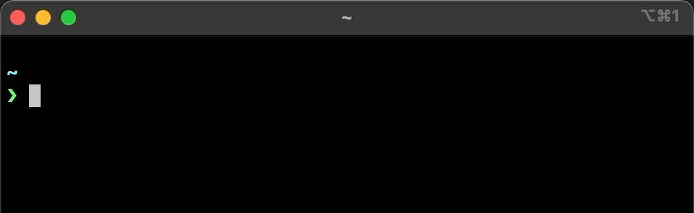

## UClip - Clipboard image uploader

[](https://github.com/ionite34/uclip/actions/workflows/build.yml)
[](https://codecov.io/gh/ionite34/uclip)

### Command line utility to upload a clipboard images to [B2 buckets][4].




> After upload, the displayed URL is also copied to the clipboard.


### Install via pip or [pipx](https://github.com/pypa/pipx)
```shell
pipx install uclip
```

### Run `--config` to set up your B2 API Keys and URL
```toml
> uclip --config
? B2 Application ID: 0013770e41044120000000001
? B2 Application Key: **********************
? B2 Bucket Name: bucket-name
? B2 Upload Path in Bucket: /screenshots/
? Alternate URL: https://img.example.org/
? File Name Length: 6
```

### The OS Keychain Service is used for secure API credential storage:
> The keychain can be set to always allow, or via biometric authentication by Touch ID or Windows Hello.

| Windows                | MacOS         | Ubuntu LTS 20.04    |
|------------------------|---------------|---------------------|
| [Credential locker][1] | [Keychain][2] | [Secret Service][3] |


[1]: https://docs.microsoft.com/en-us/windows/uwp/security/credential-locker
[2]: https://developer.apple.com/documentation/security/certificate_key_and_trust_services/keys/storing_keys_in_the_keychain
[3]: https://specifications.freedesktop.org/secret-service/latest/
[4]: https://www.backblaze.com/b2/cloud-storage.html